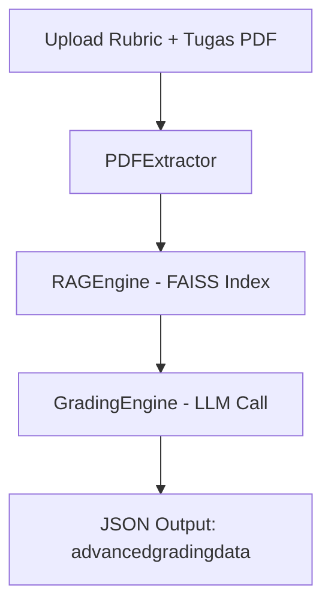

# 🤖 Auto Grading API v1

Sistem penilaian otomatis berbasis **Retrieval-Augmented Generation (RAG)** untuk menilai dokumen tugas mahasiswa berdasarkan **rubrik JSON**.  
Aplikasi ini dibangun menggunakan **FastAPI** dan mendukung model **Gemini** serta **OpenRouter (LLM API)**.

---

## 🚀 Fitur Utama

- 📄 Ekstraksi teks dan metadata dari file PDF.
- 🧠 Pemrosesan teks menggunakan **SentenceTransformer + FAISS** untuk pencarian semantik.
- 🧩 Penilaian otomatis dengan **rubrik berbasis JSON**.
- 🌐 Integrasi API dengan **Gemini** atau **OpenRouter** (pilih sesuai ketersediaan API key).
- ⚙️ Logging terpusat dan konfigurasi fleksibel via `.env`.

---

## 📁 Struktur Proyek

```
.
├── api.py                    # FastAPI endpoint utama
├── rag_grading_improved.py   # Engine utama RAG dan penilaian
├── data/
│   ├── rubrik.json           # Contoh rubrik penilaian
│   └── *.pdf                 # File tugas yang akan dinilai
├── output/                   # Hasil grading batch (opsional)
└── requirements.txt
```

---

## 🧰 Instalasi dan Setup

### 1️⃣ Clone Repository
```bash
git clone https://github.com/aura-capstone-project/<nama-repo>.git
cd <nama-repo>
```

### 2️⃣ Buat Virtual Environment
```bash
python -m venv venv
source venv/bin/activate   # (Linux/Mac)
venv\Scripts\activate      # (Windows)
```

### 3️⃣ Instal Dependensi
```bash
pip install -r requirements.txt
```

### 4️⃣ Siapkan `.env`
Contoh isi:
```bash
GEMINI_API_KEY=your_gemini_api_key
OPENROUTER_KEY=
MODEL=google/gemini-2.0-flash
EMBEDDING_MODEL=all-MiniLM-L6-v2
CHUNK_SIZE=1000
CHUNK_OVERLAP=200
TOP_K_RETRIEVAL=5
```

---

## ⚙️ Menjalankan API Server

Jalankan server FastAPI:
```bash
uvicorn api:app --host 0.0.0.0 --port 8000 --reload
```

Buka dokumentasi API:
👉 [http://localhost:8000/docs](http://localhost:8000/docs)

---

## 📤 Endpoint Utama

### `POST /api/v1/grade`

**Deskripsi:**  
Melakukan penilaian otomatis terhadap file PDF berdasarkan rubrik JSON.

**Form Data:**
| Parameter | Type | Deskripsi |
|------------|------|-----------|
| `assignment_id` | string | ID tugas |
| `user_id` | string | ID pengguna |
| `rubric` | file (.json) | File rubrik penilaian |
| `tugas` | file (.pdf) | File PDF tugas mahasiswa |

**Contoh Respons:**
```json
{
  "assignment_id": "A001",
  "user_id": "U123",
  "advancedgradingdata": {
    "rubric": {
      "criteria": [
        {
          "criterionid": 1,
          "fillings": [
            {
              "criterionid": 1,
              "levelid": 3,
              "remark": "Penjelasan hasil dan skor",
              "confidence": 0.87
            }
          ]
        }
      ]
    }
  }
}
```

---

## 🧠 Arsitektur Sistem



---

## 🧪 Mode Batch (CLI)

Selain API, sistem ini dapat menjalankan penilaian seluruh PDF di folder `data/`:

```bash
python rag_grading_improved.py
```

Hasil akan ditampilkan langsung di terminal dan disimpan dalam `output/`.

---

## 🧩 Dependensi Utama

- fastapi
- uvicorn
- PyPDF2
- faiss-cpu
- sentence-transformers
- langchain-text-splitters
- tqdm
- requests
- dotenv
---